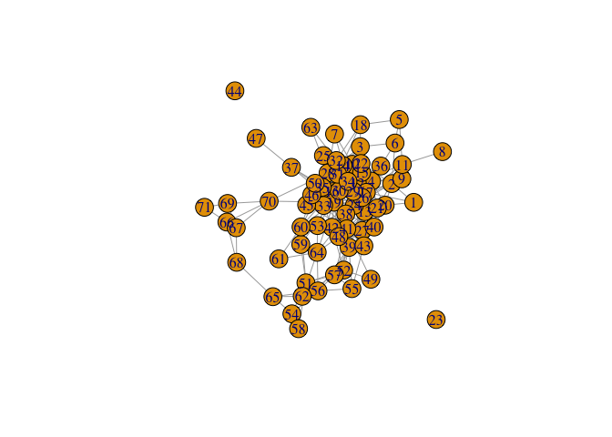

Untitled
================
02 August, 2025

heterogeneous multilayer network with hyper graph

## Multimodal Hypergraph Representation for Swedish population register:

In our project, we leverage Swedish population register data to
construct a large-scale population network, where individuals are
simultaneously embedded in multiple social contexts—including schools,
workplaces, neighborhoods, and families. Rather than treating each
context as an independent layer, we conceptualize the system as a
multimodal hypergraph, where each hyperedge links all individuals
jointly exposed to a specific social setting. This representation
naturally captures higher-order group interactions and contextual
co-presence, which are often obscured in pairwise or one-mode
projections. It also allows us to flexibly encode heterogeneous types of
ties and affiliations within a unified framework.

## Dynamic Network-Based Analysis:

Given the high density and complexity of the resulting network,
traditional structural measures may fail to capture meaningful patterns
of social proximity or segregation. We therefore incorporate dynamic
processes—such as random walks and network embedding techniques—to
better quantify social distances across demographic groups. These
methods enable us to model how individuals are likely to encounter
others through shared contexts and to learn low-dimensional
representations that preserve both local clustering and global
structural features. This approach is particularly useful for
identifying cross-context exposure, estimating inter-group connectivity,
and understanding the multilayered structure of social integration.

This manuscript uses the Workflow for Open Reproducible Code in Science
(Van Lissa et al. 2021) to ensure reproducibility and transparency. All
code <!--and data--> are available at <SocDistRW>.

This is an example of a non-essential citation (Van Lissa et al. 2021).
If you change the rendering function to `worcs::cite_essential`, it will
be removed.

<!--The function below inserts a notification if the manuscript is knit using synthetic data. Make sure to insert it after load_data().-->

## GitHub Documents

This is an R Markdown format used for publishing markdown documents to
GitHub. When you click the **Knit** button all R code chunks are run and
a markdown file (.md) suitable for publishing to GitHub is generated.

## Including Code

You can include R code in the document as follows:

``` r
plot(g)
```

<!-- -->

## Including Plots

You can also embed plots, for example:

Note that the `echo = FALSE` parameter was added to the code chunk to
prevent printing of the R code that generated the plot.

<div id="refs" class="references csl-bib-body hanging-indent"
entry-spacing="0">

<div id="ref-vanlissaWORCSWorkflowOpen2021" class="csl-entry">

Van Lissa, Caspar J., Andreas M. Brandmaier, Loek Brinkman, Anna-Lena
Lamprecht, Aaron Peikert, Marijn E. Struiksma, and Barbara M. I. Vreede.
2021. “WORCS: A Workflow for Open Reproducible Code in Science.” *Data
Science* 4 (1): 29–49. <https://doi.org/10.3233/DS-210031>.

</div>

</div>
